## What it is

FleetView is a single browser page that shows every Claude Code session running on your computer today, and tells you which of them are waiting for your answer.

Each of your folders is a small dot, called a hub: your second brain, your CRM, your content engine, and any other folder you name when you install. Every session hangs off the folder it runs in. A folder appears once it has a session today. Sessions from folders you did not name hang off a hub called **Other**.

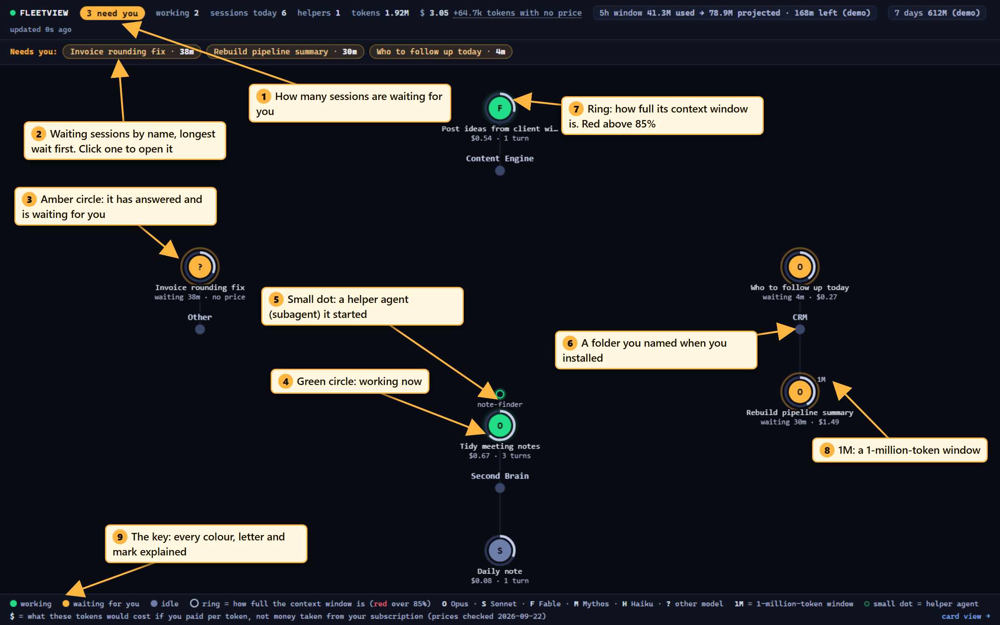

What each part of the picture means:

- **The circle's colour** is what the session is doing. Green: working. Amber: it has answered and is waiting for you. Blue-grey: idle. Amber stays until you answer, however long that takes (up to 8 hours, after which FleetView treats the session as finished and left).
- **"3 need you"** at the top left counts the amber sessions. The **Needs you** strip under it lists them by name, longest wait first, with how long each has waited. Click a name to open that session.
- **The letter inside** is the model: O Opus, S Sonnet, F Fable, M Mythos, H Haiku, and ? for any other model.
- **The ring round the circle** shows how full the session's context window is. The context window is how much text the model can keep in view at once. The ring is light grey and turns red above 85%. A small **1M** tag means the session has a 1,000,000-token window instead of the usual 200,000. A token is roughly 3 quarters of a word.
- **Under the circle** is the session's title (Claude Code gives every session a title), then either how long it has waited or its cost and number of turns. A turn is 1 reply from the model.
- **Small dots beside a circle** are helper agents (subagents) the session started in the last 30 minutes, with the helper's type underneath.
- **The top bar** adds up every session today, whether or not it is drawn: how many need you, how many are working, sessions, helpers, tokens and cost, then your **5-hour window** (tokens used, projected total, minutes left) and your **7-day total**. When idle sessions are left off the drawing, the top bar says how many and offers **show all**.
- **The key** along the bottom explains every colour, letter and mark.

Hover over any circle and a label says, in words, what it is doing.

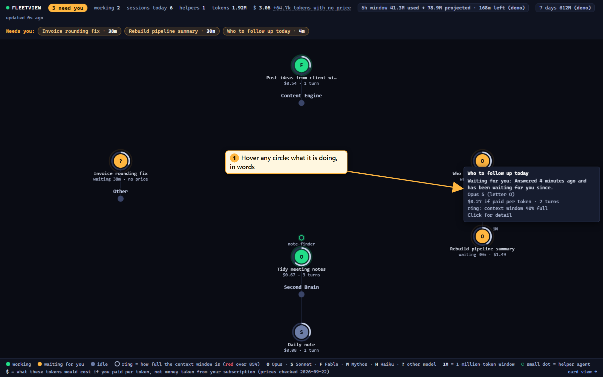

Click any circle and a side panel opens with the full detail and the session's last 10 steps. For a waiting session the panel has a **Mark as done** button: press it when you have finished with a session, so it stops showing as waiting. Press Escape to close the panel.

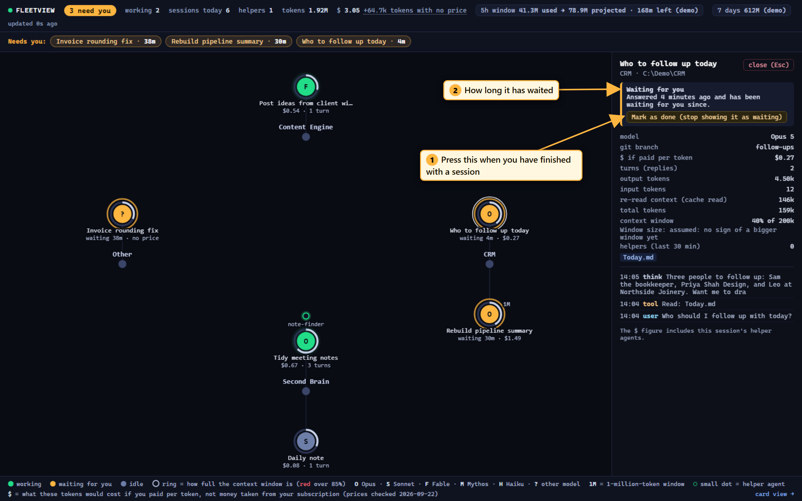

> **Note:** The dollar figures are what those tokens would cost if you paid per token. They are not money taken from your subscription. If you are on a Claude subscription (Pro or Max) you do not pay them. Read them as a size gauge. The page says this once, in its key.

There is also a card view at `http://localhost:3010/cards.html`, with the same sessions, the same totals and the same colours as cards. It works with no internet.


## Why you would want it

Once you run agents, you run several at once. A second brain session tidying notes. A CRM session working out who to follow up. A content session drafting posts. Each lives in its own terminal window.

Without FleetView you find out what each is doing by clicking through the windows. You miss the session that finished 20 minutes ago and has been waiting for your answer since. You do not see that a session's context window is 90% full and about to lose track of the start of the conversation. And on a subscription, the question that matters most is not "what did this cost" but "how close am I to my 5-hour limit", which Claude Code does not show you in a single place.

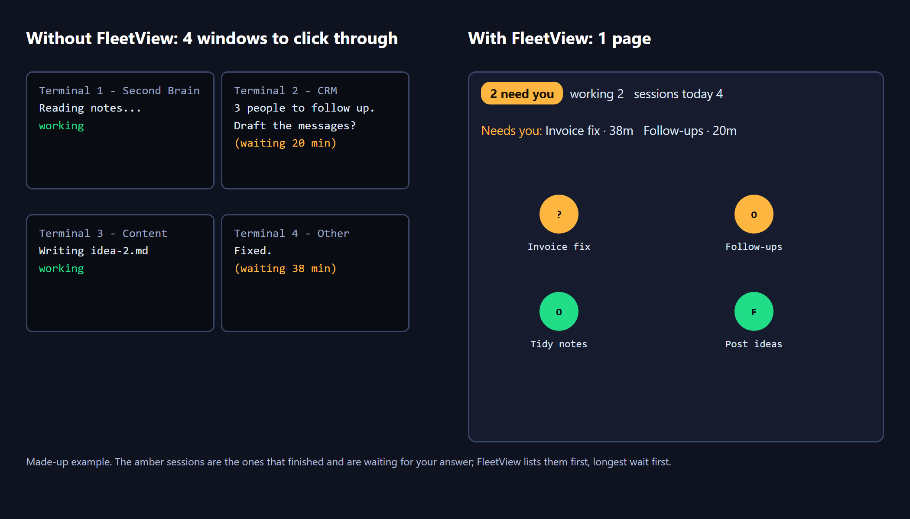

FleetView answers 3 questions at a glance:

1. Which session is waiting for me, and for how long?
2. What is running right now, and in which folder?
3. How much of my 5-hour usage window have I used, and where will I end up?

It does this without changing anything in Claude Code. It adds no hooks (a hook is a command Claude Code runs on every event), changes no settings and starts no agents. It only reads the log files Claude Code already writes to `~/.claude/projects` for every session.

## How we built it

Everything below comes from Ashley's own records. The times on 2026-06-12 are the times of the screenshots saved that day.

### 2026-06-12, afternoon: the single-tab tool that could not merge

That day Ashley installed agent-flow, an open-source tool that draws a live picture of 1 Claude Code session per browser tab, on port 3001. He wanted all his sessions in a single tab. Claude wrote a change to merge them. The data came through correctly, but agent-flow's drawing code can only draw 1 starting point per picture, so the merged sessions piled on top of each other. The change was taken back out. Ashley's verdict: *"that hasn't worked - It's not working at all."*

### The search for a single-screen tool

Claude then tried the other open-source dashboards for Claude Code:

- **Claude-Code-Agent-Monitor** (hoangsonww, 456 stars at the time) lost first. On its first start it rewrote the hooks in `~/.claude/settings.json` without asking. Then it tried to import Ashley's entire session history, 9.4 GB in 3,842 files. That used about 10 processor cores and crashed its own web server. It was stopped and its hooks were removed.
- **claude-view** lost because it runs on macOS only. 2 other tools lost because they needed Docker or Bash, which are awkward on Windows.
- **Stargx/claude-code-dashboard** won, for a single reason: it needs no hooks. It reads the log files in `~/.claude/projects` directly, so every folder on the computer is covered with no set-up. The stock card view was running by 16:56.

What was kept from it: the code that watches the log files and reads new lines as they arrive, the first version of the working, waiting and idle rules, and the card page. Its port was changed from 3001 to 3010, because agent-flow already used 3001. (Its README said a `PORT` setting worked; its code did not read it.)

### 2026-06-12, evening: the graph

A second search of GitHub found nothing that draws all live sessions as a single graph on Windows. The nearest tools either looked back at sessions after the fact or showed 1 project only. So Claude added a new data route to the server, `/api/graph`, and a new hand-drawn page, `graph.html`, with no libraries. It shows today's sessions, helper agents active in the last 30 minutes and each session's last 10 log lines, and trims idle sessions to the 3 most recent per folder. The first version was on screen at 18:55.

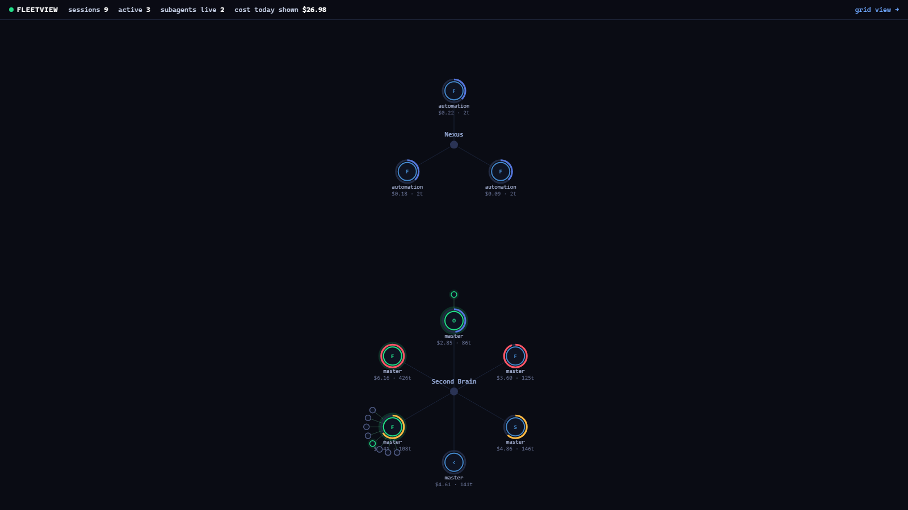

Later that evening:

- **The price table was corrected.** The original table charged Opus 4.6 at $15 per million input tokens and $75 per million output, and cache writes at 0.25 times the input rate. Both were wrong. The table also had no rows for Fable or Opus 4.8, so it priced them at Sonnet rates, below their real rates. The June fix added them.
- **22:25, token counts.** Ashley is on a subscription, so tokens matter more than dollars. The top bar gained a total token count and an output token count.
- **22:34, the 5-hour window.** Ashley: *"fix it"*. A new route, `/api/usage`, runs ccusage, a free open-source tool that works out Claude's 5-hour usage windows from the same log files. It shows used, projected and minutes left.

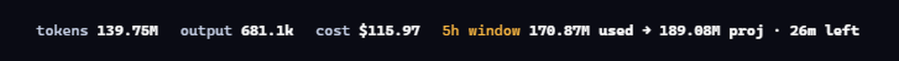

- **22:45 to 23:06, budgets and alarms.** Ashley: *"make all this so"*. A 7-day total was added. Both gauges became click-to-set budgets: green under 70%, amber from 70% to 90%, red at 90% and over. A browser notice fires once when the 5-hour projection passes the budget. No plan limit was invented; Ashley typed his own.

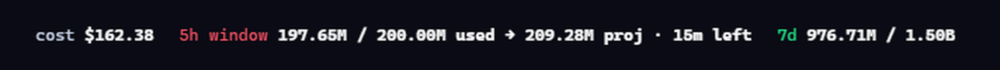

### The same evening: the other views on the same server

The same evening Claude also added a map of all 73 of Ashley's agents, called FleetMap, and a view of agents passing work between his apps, called Comms Mesh. A hidden file in his Startup folder started the server at logon. On 2026-07-02 a 3D video view, Fleet Cinema, was added to the same server; its Vault Galaxy view draws every note in his second brain as a star. None of these are in your download: they were built around Ashley's own agents and apps. They are shown here as they are, so you can see how far the same idea goes.


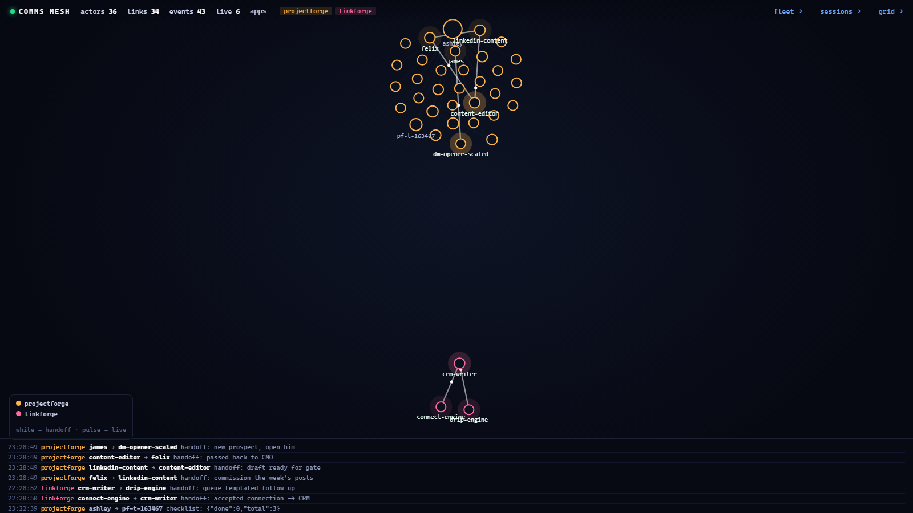

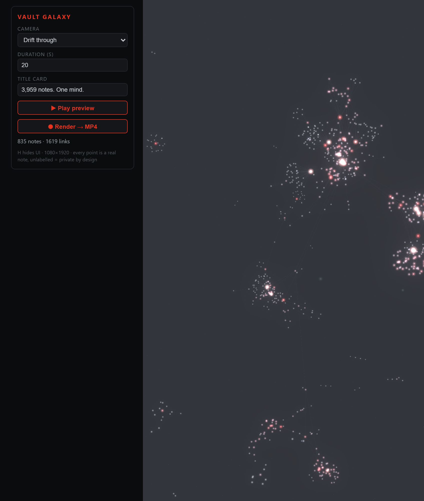

### 2026-06-21: the ruling against separate dashboards

9 days later Ashley ruled against the direction. On a page that streamed events as they happened: *"I hate seeing a stream of info - It just means nothing."* On a second standalone dashboard: *"I'd rather have this as part of Project Forge frankly."* ProjectForge is his work board. The ruling: views of the agents belong as a tab inside the work board, never as another program on another port.

### Since then: quiet

- **2026-07-27:** Ashley's tool register moved the Stargx dashboard from "ship" to "watch": 10 stars, no change since 2026-03-09, "fine for us because we can fix it", but too thin to put in front of the 6 paying members at the time.
- **2026-08-12:** the last sign in the record that it was running.
- **2026-09-22:** nothing answered on port 3010, although the Startup file was still there. Why the logon start stopped working is not recorded. A copy started by hand from a scratch folder came up in about 2 seconds.


### 2026-09-22: making it fit for you

For this download we took the original plus only the graph, the token panel and the price fix, and fixed what we found wrong on the day. It was checked 3 ways before you got it: a cold run-through of this guide by a tester who had never seen it, a usability review of the pages, and a security review of the code. What they found is fixed:

- **Amber did not last.** The original kept a session amber for 15 seconds after Claude answered, then turned it blue, so a session that asked you a question 4 minutes ago looked the same as a session nobody had touched since breakfast. Worse, Claude Code writes a few bookkeeping lines after each reply, and those reset the colour. Yours stays amber until you answer.
- **The 7-day figure counted other AI tools.** ccusage adds up every AI coding tool it finds on your computer unless it is asked for Claude only. Yours asks for Claude Code only (`ccusage claude`, checked with ccusage 20.0.24 on 2026-09-22).
- **The totals disagreed.** The graph added up only the sessions it drew, and the card page hid others. Both pages now show the same totals for every session today, and say when some are not drawn.
- **A stopped server looked alive.** If FleetView stopped, the page froze and kept a session pulsing green. Yours shows a red **FleetView stopped** banner within 4 seconds.
- **A first run before any Claude Code session saw nothing until restarted.** Yours starts reading the log folder as soon as Claude Code creates it.
- Ashley's copy grouped sessions by the folder name after `\Documents\`, which only fits his habits. Yours groups by the folders you name when you install.
- His copy had no price for Opus 5, the model every session used that day, so it priced them at Sonnet 4.6 rates. Prices now come from a table checked on 2026-09-22 against Anthropic's pricing page, and a model with no price row shows "no price" instead of a guess.
- His copy assumed every session had a 200,000-token context window. A session on a 1,000,000-token window showed 100% full. FleetView now switches to 1,000,000 when the model name ends in `[1m]` or a turn goes over 200,000.
- A Haiku helper inside an Opus session was priced as Opus, and its turns overwrote the session's context ring. Each reply is now priced with its own model.
- The original server listened on every network connection, so anyone on the same wifi could open it. Yours only answers on this computer, and refuses requests that name another website (a trick called DNS rebinding, where a web page tries to reach programs on your own computer).
- His copy ran ccusage every 60 seconds all day. Yours runs it only while a FleetView page is open.
- The card page loaded its drawing library, React, from the internet. Yours carries a copy, so it works offline.

## Pros and cons

| | Pros | Cons |
|---|---|---|
| Set-up | Reads files Claude Code already writes. No hooks, no settings changes, no database. Safe to try and safe to delete. | Needs Node.js 20.19 or newer, which you may not have. |
| Cost in tokens | Uses 0 Claude tokens. It is plain code reading files. | None. |
| Cost in time | About 5 minutes to install. Starts in seconds; Ashley's 3.2 GB history answered in about 2 seconds. | The first read of a very large history takes longer and uses some processor time. |
| What it shows | Every session in a single tab, including sessions started before FleetView, with the waiting ones first. The 5-hour gauge answers the question subscription users actually have. | It shows who is running and who is waiting, not what they are achieving. Ashley's 2026-06-21 view was that a stream of events "means nothing". |
| Waiting | Amber stays until you answer, and the Needs you strip says how long each has waited. | Every session whose last word is Claude's counts as waiting, including sessions you have simply finished with. Press Mark as done on those. |
| Accuracy | Prices checked on 2026-09-22; unknown models are flagged, not guessed. | Prices go out of date with every new model, and you must add the row yourself. The context window is a best estimate (see When it goes wrong). |
| Upkeep | Small: 1 server file and 2 pages. Your own Claude can change it in minutes. | The project it is built on is thin: 13 stars and no change since 2026-03-09 (checked 2026-09-22). You are the maintainer now. |
| Privacy | Only reachable from your own computer. | The side panel shows folder paths, file names and the start of what you typed. Careful when screen-sharing: set `hide_paths` (see Every command and setting). |

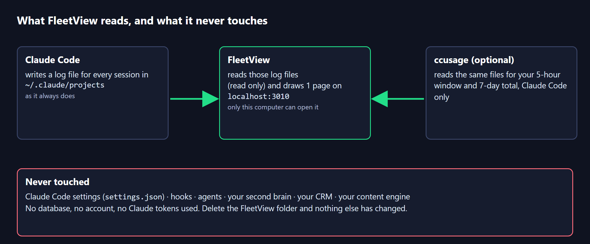

### The free ready-made alternative

If you would rather have a bigger, polished tool that someone else maintains, look at **Claude-Code-Agent-Monitor** (https://github.com/hoangsonww/Claude-Code-Agent-Monitor, MIT licence). On 2026-09-22 it had 1,012 stars and a change the day before. It is a full React app on port 4820 with a database, charts of how your agents work, a Windows and Mac desktop app with a tray icon, and 5 languages.

> **Warning:** Its set-up (`npm run setup`, then `npm run install-hooks`) adds its own hooks to `~/.claude/settings.json`, and its desktop app installs those hooks on first start. It also imports your whole session history when it first starts. On Ashley's computer on 2026-06-12 that import used about 10 processor cores and crashed it. Before you try it, copy `~/.claude/settings.json` somewhere safe, and expect 1 extra process to start on every hook event.

## Before you start

| You need | How to check | How to get it |
|---|---|---|
| Node.js 20.19 or newer | Open a terminal and type `node --version`. You should see v20.19 or higher, or v22 or higher. The file-watching library FleetView uses refuses anything older. | Windows: `winget install OpenJS.NodeJS.LTS`, or the LTS installer from https://nodejs.org. Mac: `brew install node`. Then open a new terminal. |
| Python 3 | `python --version` (on a Mac, `python3 --version`) | https://www.python.org. On Windows, if typing `python` opens the Microsoft Store, install Python from python.org and tick "Add python.exe to PATH", or type `py` instead of `python` in every command below. |
| Git | `git --version` | https://git-scm.com |
| Claude Code, used at least once | Look for the folder `.claude\projects` in your home folder | You have this from the earlier sessions. If not, FleetView still installs and starts reading the folder as soon as it appears. |
| Internet | | Needed for the install and for the first run of the 5-hour gauge (it downloads ccusage). The pages themselves need nothing from the internet. |

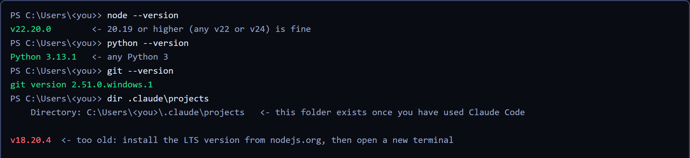

## Install it

1. Open a terminal in the folder where you keep your projects. On Windows: open File Explorer, go to Documents, right-click an empty area and choose **Open in Terminal**. On a Mac: open Terminal and type `cd ~/Documents`.
2. Copy the program to your computer and start the installer:

```
git clone https://github.com/OUTLIERS-ai/outliers-ws-02-fleetview
cd outliers-ws-02-fleetview
python install.py
```

3. The installer checks Node.js. If it is missing or older than 20.19 it tells you how to get it and stops without changing anything.
4. It downloads 2 small libraries with `npm install`. This needs internet and takes under a minute.
5. It asks where your **second brain vault** is, then your **CRM vault**. It looks for Obsidian vaults in your Documents and home folders and suggests the likely vault in brackets. Press Enter to accept, type a different path, or type `-` to skip.
6. It asks for **any other project folders**, 1 at a time. Add your content engine folder here and give it a short name such as `Content Engine`. Press Enter on an empty line to finish.
7. It asks for the **port**. Press Enter for 3010, unless something else on your computer already uses 3010.
8. It asks whether to switch on the **5-hour and 7-day token panel**. Say yes unless you have no internet.
9. It asks whether to start FleetView **automatically when you log in, with no window**. On Windows this puts a small file called `FleetView.vbs` in your Startup folder. On a Mac it writes a launchd file (Apple's way of starting programs at login) and prints the command to switch it on now.
10. It asks whether to **start FleetView now**, with no window. Say yes.
11. Open **http://localhost:3010/graph.html** in your browser. (`http://localhost:3010/` takes you there too.)

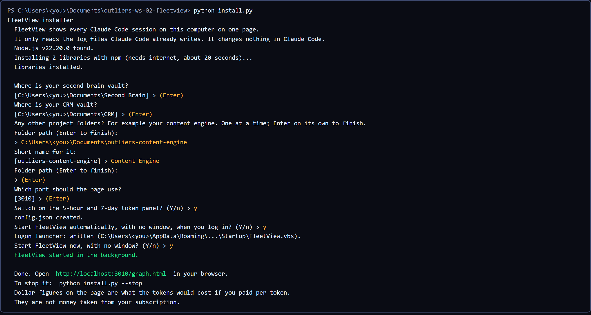

When it has worked you see your folders as hubs with today's sessions hanging off them, like the picture at the start of this guide. If you have no Claude Code session today, the page says so; start a session and it appears within 2 seconds.

> **Note:** The 5-hour gauge says "first check" for up to a minute the first time, while your computer downloads ccusage. After that it updates about once a minute while the page is open, and the 7-day total about every 5 minutes.

Running the installer again with the same answers changes nothing, and if FleetView is running it says so. If you change an answer, it saves your old settings as `config.json.bak-<date>` first, stops the running FleetView and starts it again on the new settings, so there is never more than 1 copy running.

- To stop FleetView: `python install.py --stop`. This finds it however it was started, including at logon.
- To start it again: `python install.py --start`. This only starts it, with your saved answers. It asks no questions.
- To remove the logon start as well: `python install.py --uninstall`. This stops FleetView and removes the Startup file it made.
- To remove it completely: uninstall, then delete the folder.

> **Tip:** Want to see FleetView working before your own sessions exist? In the FleetView folder run `npm run demo`, then open http://localhost:3011/graph.html. It draws 6 made-up sessions on port 3011, so it never clashes with your own copy on 3010. The same command works in PowerShell, Command Prompt and a Mac terminal. Press Ctrl+C to stop it.

## Using it day to day

- **Leave the tab open.** Pin `http://localhost:3010/graph.html` in your browser. It refreshes itself every 2 seconds, and "updated 0s ago" at the top tells you it is alive.
- **Look at the Needs you strip first.** It names every session waiting for your answer, longest wait first. Click a name to open it, then switch to that terminal and answer.

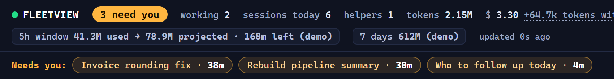

- **Finished with a session? Press Mark as done.** Every session whose last word is Claude's counts as waiting, including sessions you have finished with. Open it and press **Mark as done**; it turns grey and leaves the strip. The choice is kept in this browser. If Claude writes again in that session, it comes back.
- **"May need approval".** If a session asked to run a tool (for example a command) and nothing has come back for 30 seconds, it shows as waiting with "may need approval": Claude Code may be asking your permission in that terminal, or a long step is running. Check the terminal.
- **Watch the rings.** A red ring means that session's context window is over 85% full. Start a fresh session for the next task, or ask it to summarise and continue.
- **Set your budgets once.** Click **5h window** in the top bar and type a token number, such as `100M`. Do the same for **7 days**. Allow browser notifications when asked. With no budget the gauge stays grey; with a budget it turns amber at 70% and red at 90% of the projected total, and you get 1 notice when the projection passes your budget. The budgets are saved in this browser only. If FleetView cannot read what you typed, it says so and keeps your old budget.
- **See everything.** The graph draws every working and waiting session, plus the 3 most recent idle ones per folder. When some idle sessions are left out, the top bar says how many and offers **show all**, and each folder hub says "+2 idle not drawn". You can also add `?all=1` to the address.
- **Busy days.** Above 12 sessions the graph switches to 1 column per folder, waiting sessions at the top, so 30 sessions stay readable on a laptop screen.

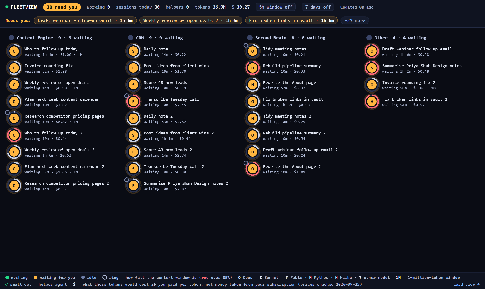

- **2 different totals.** The top-bar tokens and cost add up every session today on this computer. The 5-hour gauge counts your account's current 5-hour window, which can start yesterday evening and includes sessions no longer on screen. When they differ, the 5-hour gauge is the one that matches your usage limit.
- **Tokens that are mostly re-reads.** Most of the token total is usually "re-read context" (cache reads): Claude re-reading text it was already sent, the cheapest kind. Hover over **tokens** to see the share.
- **New model released?** Open `lib/prices.json`, add a row with the rates from https://platform.claude.com/docs/en/about-claude/pricing, then restart FleetView (`python install.py --stop`, then `python install.py --start`). Until you do, that model shows "no price" and its tokens appear in grey as "tokens with no price", left out of the dollar total.

## Fit it to your own AI system

Each change below is a prompt you can paste into Claude Code, opened in your FleetView folder. Claude reads the code and makes the change. Test with `npm test` afterwards, then restart FleetView with `python install.py --stop` and `python install.py --start`.

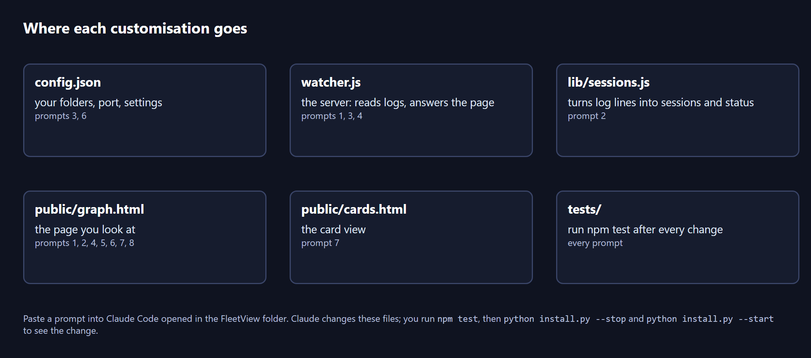

### 1. Put your CRM's today list beside the graph

Your CRM writes a ranked `Today.md` page each morning. Seeing it next to your sessions tells you whether your CRM agent has done its job yet.

```
In this FleetView folder, add a collapsible panel on the left of public/graph.html that shows my CRM's Today.md page. Add a "crm_today" path to config.json and config.example.json, add a GET /api/crm-today route in watcher.js that reads that file (read-only, never write to my CRM) and returns its text, and show the first 15 lines in the panel with the file's last-changed time. If the file is missing, show "No Today page yet". Add a test in tests/ using a made-up Today.md.
```

### 2. A plain line per session: what did I ask it?

The circles say who is running. This makes them say what each is working on.

```
In this FleetView folder, change lib/sessions.js to keep the most recent message I typed in each session (type "user", not a subagent), cut to 60 characters, and send it in the /api/graph data as "lastAsk". In public/graph.html, draw it in small grey text under each session's title, and add it to the hover label. Keep the tests passing and add a test for lastAsk.
```

### 3. An alarm that reaches you with the browser closed

Today the budget alarm and the waiting list only work while the page is open.

```
In this FleetView folder, add a server-side check to watcher.js: read "budget_5h_tokens" and "notify_waiting_minutes" from config.json. When the ccusage 5-hour projection passes the budget, or a session has been waiting for longer than notify_waiting_minutes, show a Windows notification (or a macOS notification on a Mac) once. Every subprocess call must pass windowsHide: true so no window appears. Only check while the server is running, never on a separate timer or scheduled task. Add the settings to config.example.json and explain them in README.md.
```

### 4. Cost per folder per week

See which part of your system uses the most: second brain, CRM or content engine.

```
In this FleetView folder, add a GET /api/by-folder route to watcher.js that adds up tokens and cost per folder group for the last 7 days, using the sessions already read and lib/groups.js. Add a small table at the bottom of public/graph.html, opened by clicking "by folder" in the key. Label the dollar column "$ if paid per token". Add a test with the made-up sessions from tools/make-demo.js.
```

### 5. Colour helper agents by what your agents do

Your agents live in `~/.claude/agents` and in your vault's `.claude/agents`. Each file has a description.

```
In this FleetView folder, read every agent file in ~/.claude/agents and in the .claude/agents folder of each folder listed in config.json (read-only). Sort them into up to 6 colour groups using simple keywords from each agent's description (for example: research, writing, CRM, vault upkeep, content, other). Colour each helper-agent dot on public/graph.html by its group and add the groups to the key along the bottom. Do not hard-code any agent names.
```

### 6. Flag sessions working in your content engine's drafts

When a content session is writing drafts, you usually want to review them straight after.

```
In this FleetView folder, add a "watch_folders" list to config.json, for example the drafts folder of my content engine. When a session in /api/graph has touched a file inside one of those folders in the last 30 minutes, add "touchedWatched": true, and draw a small star next to that session on public/graph.html. When the session is then waiting for me, put it first in the Needs you strip with the words "drafts ready". Add a test with made-up sessions.
```

### 7. Hide paths with 1 click for screen-sharing

The `hide_paths` setting hides folder paths, file names and what you typed, but you have to edit a file and restart. This puts it on a button.

```
In this FleetView folder, add a "hide details" button to the key of public/graph.html and public/cards.html. When pressed, the pages hide full folder paths, file names and the text of the recent steps, and show only the folder group name. Remember the choice in the browser's localStorage, wrapped in try/catch. The existing hide_paths setting in config.json should still work and should win when it is true.
```

### 8. Put it where you already look

Ashley's own ruling was that views like this belong inside the page you already work from, not in yet another tab.

```
In this FleetView folder, make public/graph.html work when shown inside another page: add a "compact=1" address option that hides the key, shrinks the top bar to "need you", working, 5h window and 7 days, and fits the graph to a small area. Then tell me the exact address to use, and how to add it to my second brain's home note or my work board as an embedded web page.
```

## Every command and setting

### Commands

| Command | What it does |
|---|---|
| `python install.py` | Checks Node.js, installs 2 libraries, asks for your folders, writes `config.json`, offers the hidden logon start, starts FleetView |
| `python install.py --start` | Starts FleetView in the background with your saved answers. No questions. Says so if it is already running |
| `python install.py --stop` | Stops FleetView, however it was started. It checks it is really FleetView first, so it never ends another program |
| `python install.py --uninstall` | Stops FleetView and removes the logon file it made. Leaves your settings and this folder |
| `python install.py --yes` | Installs with no questions, using the flags below and the defaults it finds |
| `--second-brain PATH`, `--crm PATH`, `--folder "NAME=PATH"` | Give your folders on the command line (`--folder` can be repeated) |
| `--port 3010`, `--projects-dir PATH`, `--no-ccusage` | Choose the port, a different Claude Code log folder, or switch the token panel off |
| `--launcher` / `--no-launcher`, `--no-start` | Add or skip the logon start; do not start FleetView now |
| `node watcher.js` or `npm start` | Start FleetView in this terminal, showing any error it hits. Ctrl+C stops it |
| `npm run demo` | Made-up sessions on port 3011 (see the tip in Install it) |
| `npm test` | Runs the JavaScript tests against made-up sessions |
| `python -m pytest -q` | Runs the installer tests in a temporary folder |

### Settings in `config.json`

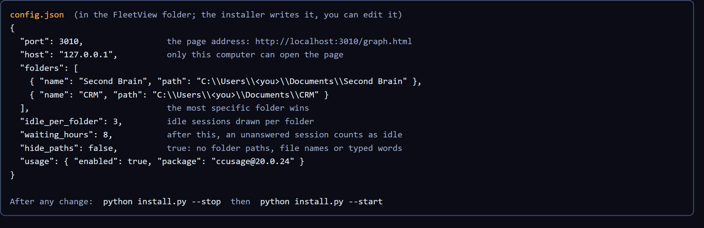

| Setting | What it does |
|---|---|
| `port` | The page's port, 3010 by default |
| `host` | `127.0.0.1`: only this computer can open the page. Leave it |
| `folders` | Your folders: `[{ "name": "CRM", "path": "..." }]`. A session belongs to the folder whose path matches most closely, so a sub-folder you name wins over its parent |
| `idle_per_folder` | How many idle sessions to draw per folder (3). The totals always count every session |
| `waiting_hours` | How long an unanswered session stays amber before it counts as finished and left (8) |
| `hide_paths` | `true` hides folder paths, file names and the text of the recent steps, for screen-sharing |
| `usage.enabled` | `false` switches the 5-hour and 7-day panel off |
| `usage.package` | The ccusage version FleetView runs (`ccusage@20.0.24`, checked 2026-09-22). Change it only on purpose |
| `projects_dir` | Only if Claude Code keeps its logs somewhere unusual |

After any change, restart FleetView: `python install.py --stop`, then `python install.py --start`. `config.example.json` shows every setting with an example.

### Files FleetView makes

- `fleetview.pid`: the running FleetView's process number and port, so `--stop` can find it. Removed when it stops.
- `fleetview.log`: what FleetView printed when it was started in the background. If it will not start, the reason is at the end of this file.
- `config.json.bak-<date>`: your old settings, saved whenever the installer changed them.

### Advanced: settings from the terminal

`PORT` overrides the port, `FLEETVIEW_CONFIG` points at a different settings file, `CLAUDE_CONFIG_DIR` points at a different Claude Code folder, and `FLEETVIEW_NO_CCUSAGE=1` switches the token panel off. `/api/graph`, `/api/usage` and `/api/meta` are the data the pages read, as plain text you can open in the browser.

## When it goes wrong

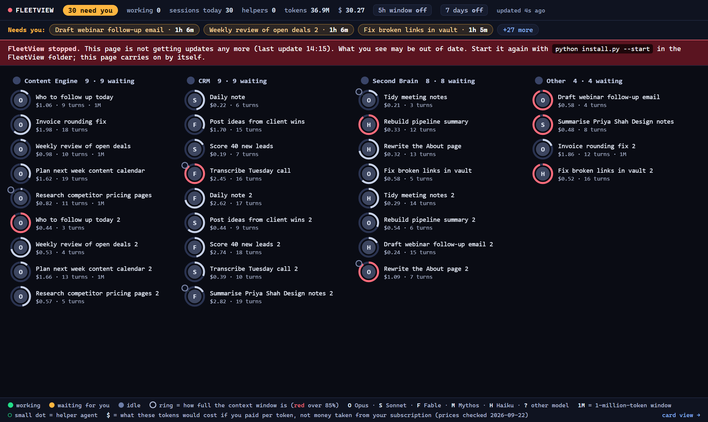

| What you see | Why | The fix |
|---|---|---|
| A red **FleetView stopped** banner | The FleetView program is no longer running, so the page is not getting updates. On Ashley's computer on 2026-09-22 the logon start had stopped working; the reason was never recorded. | Run `python install.py --start` in the FleetView folder. The page picks up by itself. If it will not start, read the end of `fleetview.log`, or run `node watcher.js` to see the error. |
| "Port 3010 is already in use" | Another program is using that port. On 2026-06-12 agent-flow was on 3001, which is why FleetView moved to 3010. | Open http://localhost:3010/graph.html; if FleetView is there, it is already running. If not, run `python install.py` again and choose another port. |
| The logon start is there but the page does not open after a restart | The Startup file points at Node.js by its full address. If you reinstalled Node.js elsewhere, the address is stale. | Run `python install.py` again and press Enter at each question; it rewrites the logon file. |
| `python` opens the Microsoft Store | Windows ships a shortcut that points at the Store until Python is installed. | Install Python from python.org and tick "Add python.exe to PATH", or type `py` instead of `python`. |
| The installer says Node.js is too old | FleetView needs Node.js 20.19 or newer. | Install the LTS version from https://nodejs.org, open a new terminal, run `python install.py` again. |
| Too many amber sessions | Every session whose last word is Claude's counts as waiting, including sessions you have finished with. | Press **Mark as done** on those, or lower `waiting_hours` in `config.json`. |
| A session shows "no price" | Its model has no row in `lib/prices.json`. Ashley's June copy had no Opus 5 row and silently used Sonnet 4.6 rates, which made every cost wrong. | Add the model's row from https://platform.claude.com/docs/en/about-claude/pricing and restart. |
| A ring sits at 100% on a long session | The session has a 1,000,000-token window but FleetView had not seen evidence of it yet. Ashley's copy always assumed 200,000. | FleetView switches to 1,000,000 when the model name ends in `[1m]` or a turn passes 200,000. The side panel says which rule it used. Until then, a ring on a 1M session reads high. |
| 5-hour gauge shows "not available" | ccusage could not run: no internet on the first run, or npx is blocked. | Hover over the gauge to see the reason. Check your internet, or switch the panel off in `config.json` (`"usage": {"enabled": false}`). |
| A session you just started does not appear | Before your first Claude Code session the log folder does not exist. | Wait a few seconds: FleetView looks for the folder every 3 seconds and starts reading as soon as it appears. The empty page tells you which folder it is waiting for. |
| Top-bar cost and the 5-hour gauge disagree | They count different sessions: the top bar every session today, the gauge your account's current 5-hour window. | Trust the 5-hour gauge for your limit. Treat the top bar as "today on this computer". |
| Another dashboard filled your `settings.json` with hooks | That was Claude-Code-Agent-Monitor on 2026-06-12, not FleetView. FleetView never touches `settings.json`. | Restore the copy of `settings.json` you made before installing it. |

## Download

The code, this guide's source and the tests: **https://github.com/OUTLIERS-ai/outliers-ws-02-fleetview**

```
git clone https://github.com/OUTLIERS-ai/outliers-ws-02-fleetview && cd outliers-ws-02-fleetview && python install.py
```

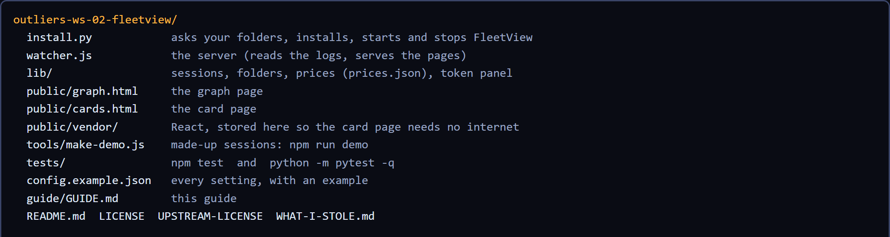

FleetView is built on Stargx/claude-code-dashboard (MIT licence, Copyright (c) 2025 Cold Beam Games), uses ccusage (MIT licence) for the 5-hour and 7-day gauges, and carries React 18.3.1 (MIT licence) for the card page. Prices were checked on 2026-09-22.
